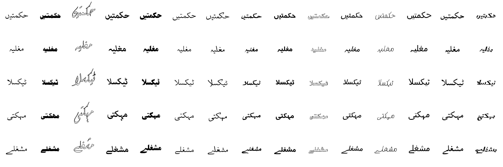

# Qaida
Qaida is a data set of 18,569 ligatures in [Urdu](https://en.wikipedia.org/wiki/Urdu) language synthetically 
generated in 256 different fonts. The data set consist for 3,713,800 training images and 1,039,864 test images, each having 80x80 pixels belonging to 18,569 ligature classes. Each ligature class in the training data images rendered using 200 unique fonts while the test 
data contains each class rendered in 56 fonts. Fonts are kept unique across training and test set making it viable for
 a font-independent OCR system.
 
Here is an example how the data looks (each row represents a different class):


###  Urdu Script
[Urdu](https://en.wikipedia.org/wiki/Urdu) is written in [Arabic script](https://en.wikipedia.org/wiki/Arabic_script) in a cursive format from right to left using an extended Arabic character set. Two or more characters are joined as a single glymph to form a [ligature](https://en.wikipedia.org/wiki/Orthographic_ligature). There are about [18,569 valid ligatures](http://www.cle.org.pk/software/ling_resources/UrduLigatures.htm) in Urdu. 

### Why we made Qaida
OCR algorithms, have received a significant improvement in performance recently, mainly due to the increase
in capabilities of artificial intelligence algorithms. However this advancement is not evenly distributed over all 
languages. Urdu is also among the languages which did not receive much attention, specially in the font independent 
perspective.
One of the main reason for this, is intra-class variability of the letters in Urdu; unlike English and other Latin based 
languages, letters in Urdu are not constrained to only a single shape. Their shape changes with their position within
the ligature and vary from one to four. There are almost [18,569 valid 
ligatures](http://www.cle.org.pk/software/ling_resources/UrduLigatures.htm) in Urdu which are to be recognized as 
compared to only 52 characters (excluding numbers and punctuations) in English.

Qaida is an attempt to advance the research in font independent printed Urdu test recognition. To the best of our knowledge, this is the first large scale multi-font data set for Urdu language. 

### Get the data
| Name  | Content | Classes | Examples | Size | Link | MD5 Checksum|
| --- | --- |--- | --- | --- |--- |--- |
| `train.tar.xz`        | training set images   |18,569  | 3,713,800   |2.6 GBytes      | [Download](https://drive.google.com/file/d/1ihemYqrIDklByJIxk1tKyxg3cISYQIYQ/view?usp=sharing)|`90ffe6411c5147ecc89764909cc6395a`|
| `test.tar.xz`         | test set images       |18,569  | 1,039,864   |461 MBytes      | [Download](https://drive.google.com/file/d/1EvM5SqDruOn1RBHf7vFk2ITS3sze90og/view?usp=sharing)|`847a146ecd9fc2db6e62a38eea475db6`|
| `ligature_map`        | index to ligature mapping|18,569  | 18,569     | 195.4 KBytes      | [Download](https://drive.google.com/file/d/15DeuaZncztB837WidRKuIuRWrzM981IF/view?usp=sharing)|`0c1b2e60b1c751d1a14c5eb90fec745e`|
| `train_2k.tar.xz`     | training set images   |2,000   | 400,000    |279 MBytes      | [Download](https://drive.google.com/file/d/1oQk6Hs13JL5OkW2EpS0-zSUAVX7SORzp/view?usp=sharing)|`847a146ecd9fc2db6e62a38eea475db6`|
| `test_2k.tar.xz`     | test set images       |2,000   | 112,000    | 79 MBytes      | [Download](https://drive.google.com/file/d/196rEKpsLlNOWCoTQv3TVjTnq8nP0FPXr/view?usp=sharing)|`847a146ecd9fc2db6e62a38eea475db6`|
| `ligature_map_2k`        | index to ligature mapping|2000  | 2,000     | 21.3 KBytes      | [Download](https://drive.google.com/file/d/1ZHF2AY_DdDfOr2MKnZAsr_mwk61IYG-E/view?usp=sharing)|`37bbd4e44ae486dbb5d7e98801811ae4`|
| `train_200.tar.xz`     | training set images   |200   | 40,000    |24.1 MBytes      | [Download](https://drive.google.com/file/d/1Rl5COEQFn0-xN6_LJeSLvyyS9XUMi5Kj/view?usp=sharing)|`a42b6a78a2f73d826b7b8ccbdaf5a60b`|
| `test_200.tar.xz`     | test set images       |200   | 11,200    | 5.9 MBytes      | [Download](https://drive.google.com/file/d/1RX_462Ecq8Mj2srmdEh2l5-w0hrU7T_o/view?usp=sharing)|`bc0aa5b0307d5a6e122acc2767d25c04`|
| `ligature_map_200`        | index to ligature mapping|200  | 200     | 1.4 KBytes      | [Download](https://drive.google.com/file/d/1n2Gcv1MUHcxYg0Y2nAIdNh3U7XoSKu8Z/view?usp=sharing)|`d8c38d3398b97549204d5d2c9a8b13ce`|


#### Data format
The training and test data sets are arranged in the following data structure:

```markdown
train
|
├── 0               // directory name is class index
│   ├── 1.jpg
│   ├── 2.jpg
│   └── ...
|
├── 1               
│   ├── 1.jpg
│   ├── 2.jpg
|   └─── ...
|
└── ...

```

#### Mapping directory/class to ligature 
Since the ligatures are in unicode format the directory names are kept as unique integers, starting from 0 to 18,568.
The mapping from index to ligature can created using the mapping files present in `./data/ligatures_map` for 18,569 classes
 and `./data/ligatures_map_2k` for 2,000 classes. These mapping files can also be downloaded alongside the data set. 
 The code for reading the mapping is as follows:
 
```python
import codecs
with codecs.open('./data/ligatures_map', encoding='UTF-16LE') as ligature_file:
    ligatures_map = ligature_file.readlines()

class_idx = 18313
ligature = ligatures_map[class_idx]
print(ligature)

>>>  نستعلیق
``` 

### Tutorials
- Pytorch

    [](https://colab.research.google.com/drive/1na46Dw-iZFWTTx9FNKr9eiNhej9TNjRE) for loading and training on first 2,000 classes [Warning! GPU instance required]
    
    
    [](https://colab.research.google.com/drive/1OEaZZ13bzB54eaFaw9yvQthuFrDAwa8u) for loading and training on all classes [Warning! TPU instance required]
 
 - Tensorflow
 
    [](https://colab.research.google.com/drive/140f7rKrcgaT3ga-Zg2BXdCgXj2v2AV2p) for loading the dataset in tensorflow 2.0 [Warning! GPU instance required]
 

### Installation
- Download  and install [anaconda](https://www.anaconda.com/distribution/) for your OS
- Create the environment using `./qaida_env.yml`
```
conda env create -f qaida_env.yml
```


### Contributing
 Thanks for your interest in contributing! There are many ways to get involved; start with these [open issues](https://github.com/AtiqueUrRehman/qaida/issues) for specific tasks.

---
### Authors
- [Sibt Ul Hussain](https://sites.google.com/site/sibtulhussain/) 
- [Atique Ur Rehman](https://www.linkedin.com/in/atiqueurrehman/)

### License

Copyright (c) 2020 Atique Ur Rehman

Data licensed under CC-BY 4.0: https://creativecommons.org/licenses/by/4.0/

TODO
- [ ] Add data download and extraction script in ./data/
- [ ] Add uses for an OCR system e.g pdf converter
- [ ] Code from loading and training locally
- [ ] Add visualizations
- [ ] Add tutorials for Tensorfow and loading data using Hdf5
